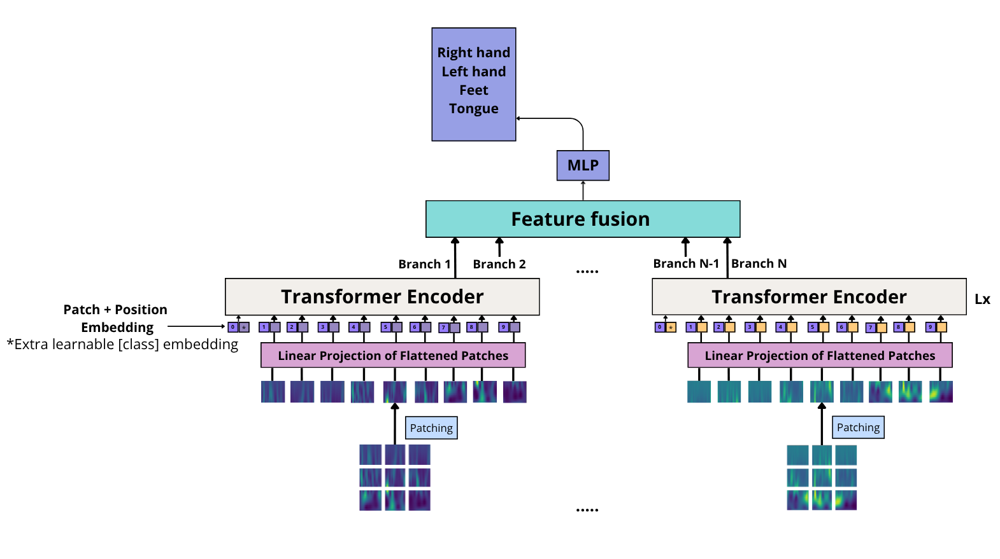
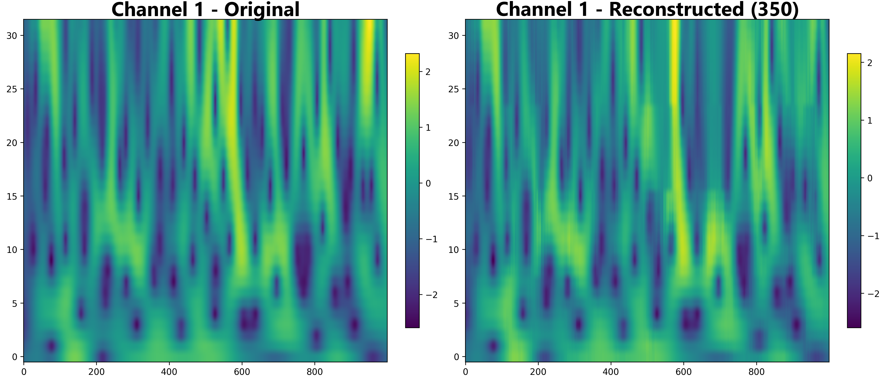
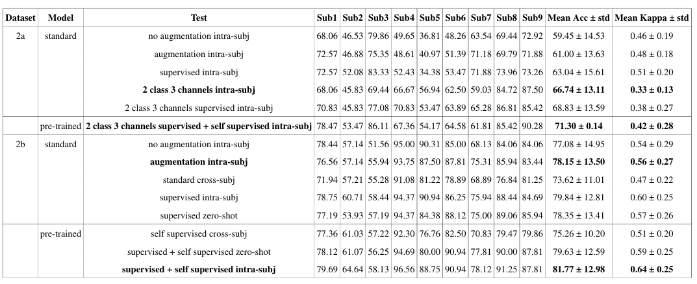

# Multi-Channel Vision Transformer for EEG Motor Imagery

Hi all!  
This repository contains my thesis project, where I developed a multi-channel Vision Transformer for motor imagery prediction using the BCI Competition IV 2a and 2b datasets.

Thanks to self-supervised pre-training on EEG spectrograms, I was able to achieve strong results.

What really sets this project apart from other motor imagery studies are two key ideas:

- using a Vision Transformer to process EEG signals in the form of spectrograms  

  

- applying a novel masked self-supervised pre-training approach to address the limited data problem  

  

The final model is pre-trained on EEG data that go beyond motor imagery, including brain activity from different subjects and tasks.  
This leads to a 4% performance improvement over the initial model and shows that a large neural network, trained on a sufficiently diverse dataset, can learn meaningful patterns across subjects and generalize to similar data distributions.  

Additionally, the network becomes capable of reconstructing the EEG signal, which can also be observed visually.

  

## Results

Below are the final results, where the pre-trained model is compared with the baseline model and other approaches to highlight the performance improvement.

  

Additional intermediate results are available in the full thesis.

The next step is to scale up training with an even larger EEG dataset.

## Repository contents

- the model architecture  
- the preprocessing pipeline  
- the full thesis (detailed version)  
- a presentation in PDF format  
